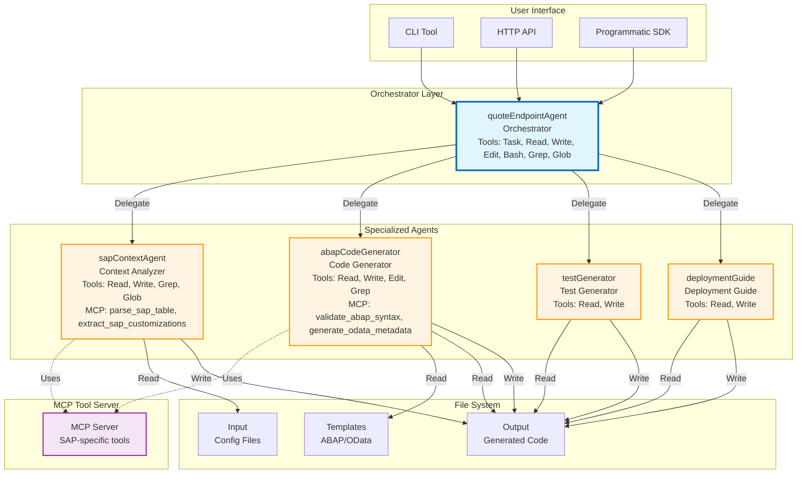
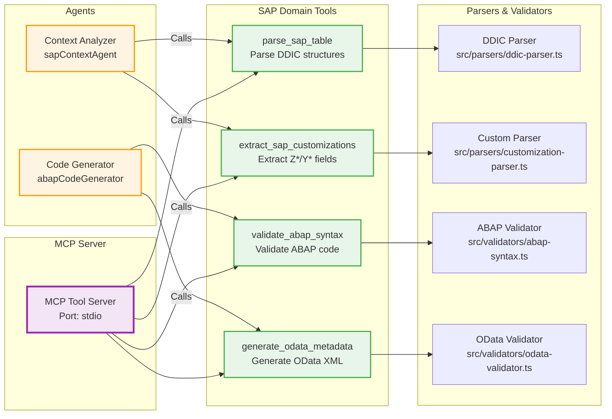
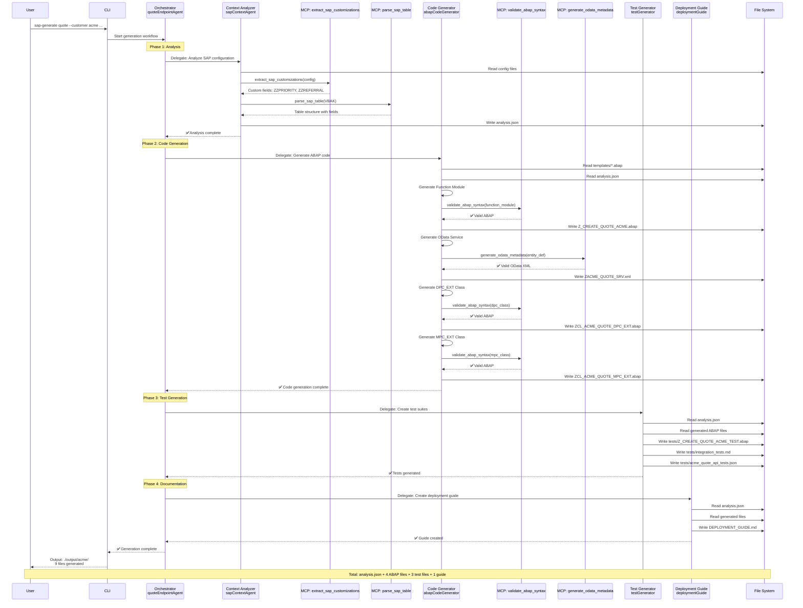
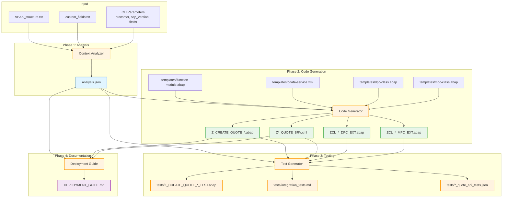
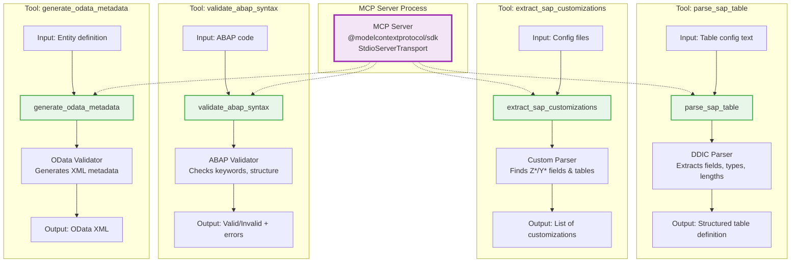
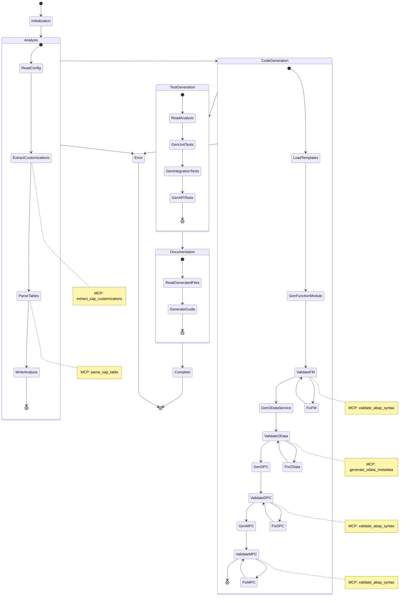
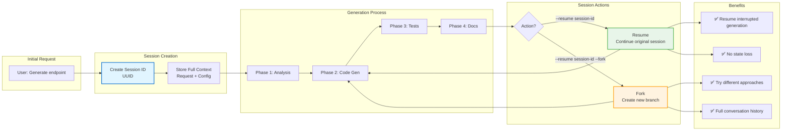

# SAP Agent Architecture

Comprehensive diagrams showing the multi-agent architecture, MCP tools, and data flow.

## 1. Agent Overview & Responsibilities

## 2. MCP Tools & Agent Mapping

## 3. Complete Generation Workflow

## 4. Data Flow & File Dependencies

## 5. MCP Tool Details

## 6. Agent Tool Access Matrix

| Agent | Built-in Tools | MCP Tools | Purpose |
|-------|----------------|-----------|---------|
| **quoteEndpointAgent** (Orchestrator) | Task, Read, Write, Edit, Bash, Grep, Glob | None | Coordinate workflow, delegate to subagents |
| **sapContextAgent** (Context Analyzer) | Read, Write, Grep, Glob | `parse_sap_table` `extract_sap_customizations` | Analyze SAP config, extract customizations |
| **abapCodeGenerator** (Code Generator) | Read, Write, Edit, Grep | `validate_abap_syntax` `generate_odata_metadata` | Generate & validate ABAP code |
| **testGenerator** (Test Generator) | Read, Write | None | Create test suites from generated code |
| **deploymentGuide** (Deployment Guide) | Read, Write | None | Write deployment documentation |

## 7. Execution Flow with Error Handling

## 8. Session Management & Resumption

## Key Architectural Principles

### 1. Separation of Concerns
- **Orchestrator**: Workflow coordination only
- **Specialized Agents**: Domain-specific tasks
- **MCP Tools**: SAP-specific operations

### 2. Delegation Pattern
- Main agent delegates to subagents
- Each subagent has focused responsibility
- Clear inputs/outputs between agents

### 3. Tool Specialization
- **Context Analyzer**: Uses SAP parsing tools
- **Code Generator**: Uses validation tools
- **Test/Docs Generators**: Use file I/O only

### 4. Validation at Every Step
- ABAP syntax validation after each code gen
- OData metadata validation
- Analysis data validation
- Configuration file validation

### 5. Stateless Execution with Session Support
- Each agent execution is independent
- Sessions preserve full context for resumption
- Forking enables exploration without loss

### 6. File-Based Communication
- `analysis.json` is the contract between agents
- Templates drive code generation
- Generated files are inputs to downstream agents
