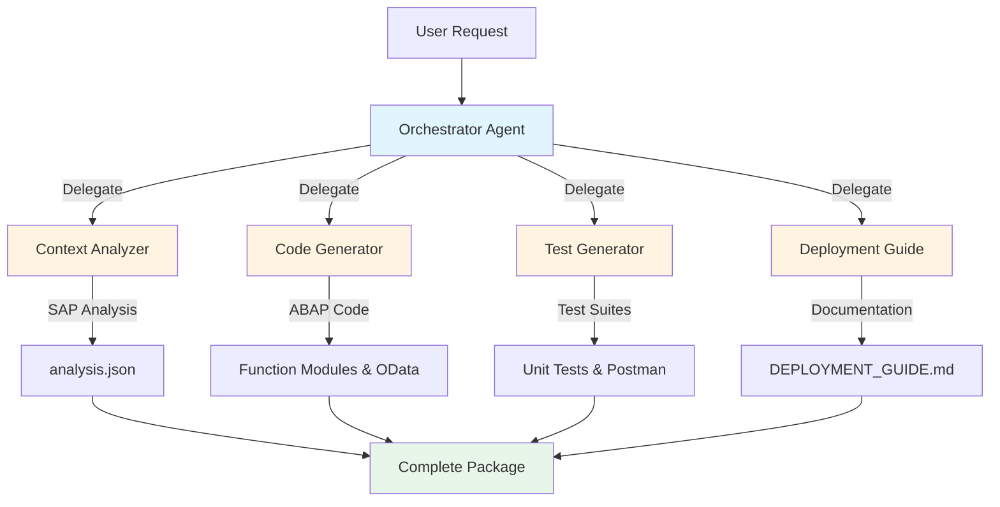
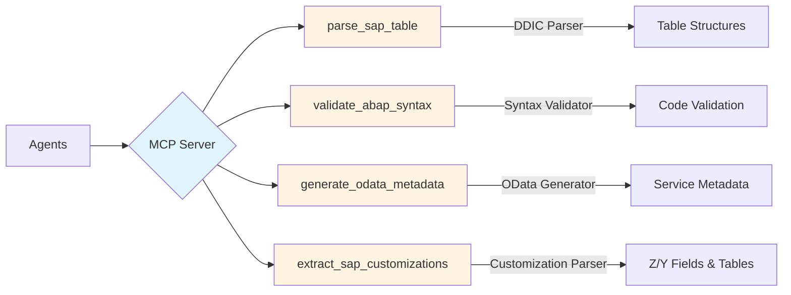
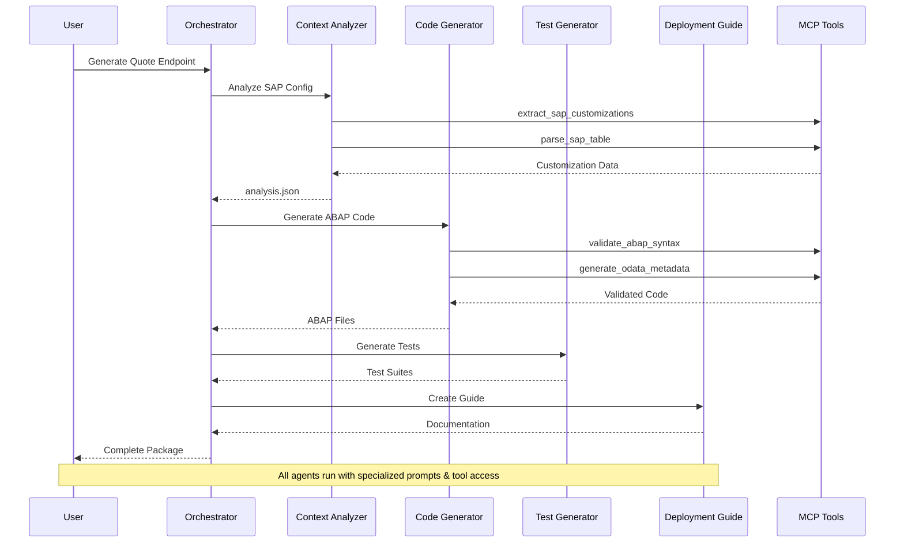

# SAP Endpoint Generator

> AI-powered SAP ABAP code generator for OData endpoints using Claude Agent SDK

**Solve the REAL pain of ERP integrations:** Automatically generate production-ready ABAP code **inside your SAP system** in minutes instead of days. No more painful manual coding, transaction navigation hell, or consultant fees.

## TL;DR

**Problem:** ERP integrations fail because creating endpoints INSIDE SAP (ABAP code) is expensive, slow, and requires rare expertise.

**Solution:** Auto-generate production-ready SAP endpoints in 5-15 minutes with:
- Complete ABAP code (function modules, OData services, classes)
- Comprehensive tests (ABAP Unit, integration scenarios, Postman)
- Deployment guides with exact transaction codes (SE37, SEGW, SICF)
- Support for custom fields, business logic, and multiple SAP versions

## The Real Problem with ERP Integrations

Most integration tools focus on **calling APIs and transforming data** - the easy 5% of the work.

**The real pain (80% of effort) is creating the endpoints INSIDE legacy ERP systems:**
- Writing ABAP code in SAP (painful, slow, requires rare expertise)
- Navigating complex SAP transactions (SE37, SEGW, SICF, PFCG - "a big mess")
- Handling customer-specific customizations (every customer is different)
- Debugging in SAP (inconvenient, time-consuming)
- Getting reliable, production-ready code

**This generator solves that pain.** We auto-generate the SAP-side ABAP code, complete with exact transaction codes and deployment steps.

## What the SAP-Agent can generate (The Hard 80%)

**Inside your SAP system (the part that's actually hard):**
- **ABAP Function Modules** with proper error handling, authorization checks, and transaction safety
- **OData Service Definitions** (V2/V4) with complete metadata and annotations
- **Data Provider Classes (DPC)** with CREATE/READ/UPDATE/DELETE operations
- **Model Provider Classes (MPC)** with field constraints and business logic
- **Complete Test Suites**: ABAP Unit tests (26+ methods), integration test scenarios, Postman collections
- **Deployment Guides**: Exact SAP transaction codes (SE37, SEGW, SICF, PFCG) with step-by-step instructions

## Quick Start

### Installation

```bash
# Clone the repository
git clone <repository-url>
cd sap-agent

# Install dependencies
npm install

# Build the project
npm run build
```

### Initialize a New Project

```bash
# Create example configuration files
npx sap-generate init

# This creates:
# - sap-config/VBAK_structure.txt
# - sap-config/custom_fields.txt
# - example-command.sh
```

### Generate Your First Endpoint

```bash
npx sap-generate quote \
  --customer acme \
  --sap-version ECC6 \
  --config-files sap-config/VBAK_structure.txt sap-config/custom_fields.txt \
  --fields customer_id quote_date valid_until total_amount \
  --custom-fields '{"ZZPRIORITY":"Priority level","ZZREFERRAL":"Referral source"}' \
  --special-logic "Apply 10% discount for VIP customers"
```

### What Gets Generated

After running the generator, you'll find these files in `./output/{customer}/`:

```
output/acme/
├── analysis.json                           # SAP system analysis
├── Z_CREATE_QUOTE_ACME.abap               # Function module
├── ZACME_QUOTE_SRV.xml                    # OData service definition
├── ZCL_ACME_QUOTE_DPC_EXT.abap           # Data provider class
├── ZCL_ACME_QUOTE_MPC_EXT.abap           # Model provider class
├── DEPLOYMENT_GUIDE.md                     # Step-by-step deployment instructions
└── tests/
    ├── Z_CREATE_QUOTE_ACME_TEST.abap      # ABAP unit tests
    ├── integration_tests.md                # Integration test scenarios
    └── acme_quote_api_tests.json          # Postman collection
```

## CLI Commands

### Generate Quote Endpoint

```bash
sap-generate quote [options]

Options:
  -c, --customer <name>          Customer name (required)
  -v, --sap-version <version>    SAP version: R3, ECC6, or S4HANA (required)
  -f, --config-files <files...>  SAP configuration files (required)
  -o, --output <dir>             Output directory (default: ./output)
  --fields <fields...>           Required quote fields
  --custom-fields <json>         Custom fields as JSON
  --special-logic <text>         Special business logic description
  --resume <session-id>          Resume from a previous session ID
  --fork                         Fork the resumed session (creates new branch)
```

### Initialize Project

```bash
sap-generate init [options]

Options:
  -d, --directory <dir>          Project directory (default: current)
```

### Validate Config Files

```bash
sap-generate validate [options]

Options:
  -f, --files <files...>         Config files to validate (required)
```

## Configuration Files

The generator needs SAP configuration files to understand your system. These are typically exports from SAP transactions.

### VBAK Structure File

Export table structure from SE11 or SE16:

```
Table: VBAK
Sales Document: Header Data

Field         Data Type  Length  Description
* MANDT       CLNT       3       Client
* VBELN       CHAR       10      Sales Document
ERDAT         DATS       8       Creation Date
...

Custom Fields:
ZZPRIORITY    NUMC       1       Priority Level
ZZREFERRAL    CHAR       20      Referral Source
```

### Custom Fields File

Document your custom fields:

```
Table: VBAK

Field Name     Type  Length  Description
ZZPRIORITY     NUMC  1       Customer Priority (1-5)
ZZREFERRAL     CHAR  20      Referral Source Code

Table: VBAP

Field Name     Type  Length  Description
ZZWARRANTY     NUMC  2       Warranty Period (Months)
```

## Architecture

📘 **See [ARCHITECTURE.md](ARCHITECTURE.md) for comprehensive diagrams and detailed architecture documentation.**

### Agent-Based Generation

The SAP Endpoint Generator uses a multi-agent architecture powered by Claude Agent SDK with specialized subagents:

1. **Orchestrator Agent** (`quoteEndpointAgent`): Coordinates the overall workflow
2. **Context Analyzer** (`sapContextAgent`): Analyzes SAP configuration and extracts customizations
3. **Code Generator** (`abapCodeGenerator`): Generates ABAP code from templates
4. **Test Generator** (`testGenerator`): Creates comprehensive test suites
5. **Deployment Guide Generator** (`deploymentGuide`): Writes step-by-step deployment documentation

#### Multi-Agent Workflow



#### MCP Tools Integration



#### Generation Flow



### MCP Tools

Custom Model Context Protocol (MCP) tools provide SAP-specific capabilities:

- `parse_sap_table`: Parse SAP table structures from DDIC exports
- `validate_abap_syntax`: Validate generated ABAP code
- `generate_odata_metadata`: Generate OData service metadata XML
- `extract_sap_customizations`: Extract customizations from config files

### Session Management

The generator captures session IDs for resumption and forking:

#### Programmatic API

```typescript
const { sessionId } = await generateQuoteEndpoint(request);

// Resume the session to continue work
const resumed = await generateQuoteEndpoint({
  ...request,
  resume: sessionId,
  forkSession: false  // Continue original session
});

// Fork to try alternative approaches
const forked = await generateQuoteEndpoint({
  ...request,
  resume: sessionId,
  forkSession: true  // Create new branch
});
```

#### CLI Usage

```bash
# Initial generation - save the session ID from output
sap-generate quote --customer acme --sap-version ECC6 --config-files config/*.txt
# Output: ✅ Session ID: abc-123-xyz

# Resume the session to continue where you left off
sap-generate quote --resume abc-123-xyz --customer acme --sap-version ECC6 --config-files config/*.txt

# Fork the session to try a different approach
sap-generate quote --resume abc-123-xyz --fork --customer acme --sap-version ECC6 --config-files config/*.txt
```

**Benefits:**
- **Resume interrupted generation** - Continue from where you left off
- **Fork workflows** - Explore different approaches without losing original
- **Session history** - Full conversation context preserved

## Production Deployment

### Deploy to Modal (TypeScript SDK)

For pilot customers and production use, deploy to Modal for serverless, on-demand code generation:

```bash
# Install Modal CLI (one-time setup)
pip install modal
modal setup

# Add your Anthropic API key
modal secret create anthropic-api-key ANTHROPIC_API_KEY=sk-ant-...

# Start the API server
npm run serve
```

This creates an HTTP API with interactive Swagger documentation:

**Interactive API Docs:** http://localhost:3000/api-docs

**Example API Call:**
```bash
curl -X POST http://localhost:3000/api/generate \
  -H "Content-Type: application/json" \
  -d '{
    "customer_name": "acme",
    "sap_version": "ECC6",
    "config_files": {
      "VBAK_structure.txt": "Table: VBAK\n..."
    },
    "quote_fields": ["customer_id", "quote_date"]
  }'
```

**API Endpoints:**
- `GET /api-docs` - Interactive Swagger UI
- `POST /api/generate` - Generate SAP code
- `GET /api/download/:customer` - Download code as tar.gz
- `GET /api/customers` - List all customers

### Cost Estimation

**For 10 generations/day:**
- Infrastructure (Modal): **~$2.40/month**
- AI API (Anthropic): **~$600/month**
- Storage: **<$0.01/month**

**Total: ~$600/month** (dominated by API costs)

### Web Interface

A ready-to-use web interface is provided in `examples/web-client.html`:

```bash
# Update the endpoint URL in the file
sed -i 's/YOUR_MODAL_ENDPOINT_URL_HERE/https:\/\/your-endpoint.modal.run/' examples/web-client.html

# Serve it
python -m http.server 8000
# Open http://localhost:8000/examples/web-client.html
```

### Documentation

See [DEPLOYMENT.md](DEPLOYMENT.md) for complete deployment guide including:
- Security considerations
- Monitoring and observability
- Integration examples (React, FastAPI)
- Session management in production
- Pilot customer checklist

## Development

### Project Structure

```
sap-agent/
├── src/
│   ├── agents/              # Agent definitions
│   ├── mcp-server/          # MCP tools and server
│   ├── parsers/             # SAP config parsers
│   ├── validators/          # Code validators
│   ├── templates/           # ABAP code templates
│   ├── types/               # TypeScript types
│   ├── index.ts             # Main entry point
│   └── cli.ts               # CLI tool
├── examples/                # Example SAP configs
├── tests/                   # Test suite
└── output/                  # Generated code output
```

### Running Tests

```bash
# Run all tests
npm test

# Run with coverage
npm test -- --coverage

# Watch mode
npm run test:watch

# Lint code
npm run lint
npm run lint:fix  # Auto-fix issues
```

### Building

```bash
# Clean build directory
npm run clean

# Compile TypeScript
npm run build

# Development mode
npm run dev
```

## Deployment

### Step 1: Generate Code

```bash
sap-generate quote --customer {name} --sap-version {version} ...
```

### Step 2: Review Generated Files

Check the code in `./output/{customer}/`

### Step 3: Follow Deployment Guide

Open `DEPLOYMENT_GUIDE.md` and follow the step-by-step instructions:

1. Create transport request
2. Create function module (SE37)
3. Create OData service (SEGW)
4. Activate ICF service (SICF)
5. Configure authorization (PFCG)
6. Test the endpoint

### Step 4: Test

Use the generated Postman collection to test the API.

## Examples

### Basic Quote Endpoint

```bash
sap-generate quote \
  --customer acme \
  --sap-version ECC6 \
  --config-files config/VBAK.txt config/custom_fields.txt \
  --fields customer_id quote_date valid_until
```

### With Custom Logic

```bash
sap-generate quote \
  --customer vip_customer \
  --sap-version S4HANA \
  --config-files config/*.txt \
  --custom-fields '{"ZZVIP":"VIP Flag","ZZDISCOUNT":"Discount %"}' \
  --special-logic "Automatically approve quotes under $10K for VIP customers"
```

## Troubleshooting

### Config Files Not Found

Ensure file paths are correct and files exist:

```bash
sap-generate validate --files config/*.txt
```

### Invalid SAP Version

Use one of: `R3`, `ECC6`, or `S4HANA` (case-insensitive)

### Custom Fields JSON Error

Ensure JSON is properly quoted:

```bash
--custom-fields '{"FIELD":"Description"}'
```

## Contributing

Contributions are welcome! Please:

1. Fork the repository
2. Create a feature branch
3. Make your changes
4. Add tests
5. Submit a pull request